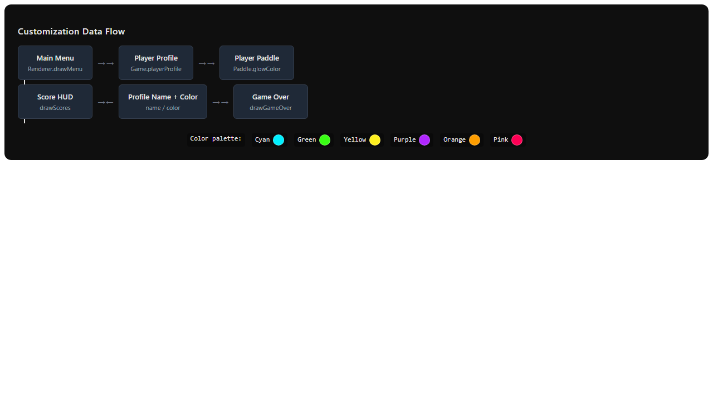
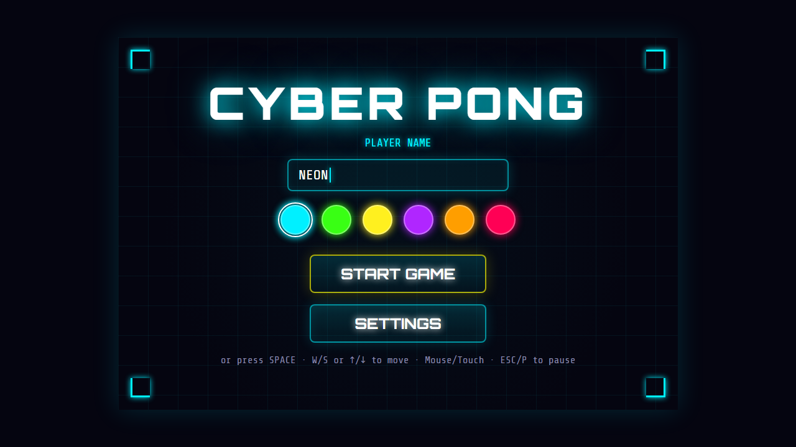
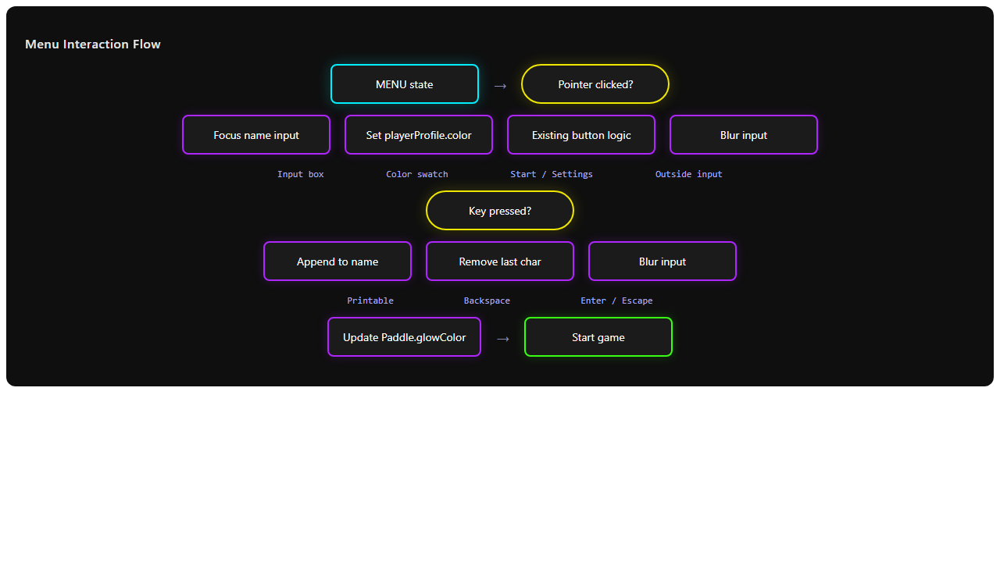

# Issue #4: Add player name input and paddle color customization to main menu

## Summary
Add a canvas-based player name input field and a row of neon color swatches to the main menu. The chosen name and color must flow through to the player paddle glow, the in-game score label/number, and the game-over winner text. The CPU opponent keeps its default "CPU" name and magenta color.

## Root Cause Analysis
This is a feature request, not a bug. The current codebase has no concept of a player profile:

- The player paddle hard-codes `glowColor = '#00f0ff'` in the `Paddle` constructor.
- The score labels are hard-coded as `'PLAYER'` and `'CPU'`.
- The game-over winner text always renders `'PLAYER WINS'` or `'CPU WINS'`.
- The main menu only shows the title, **START GAME**, and **SETTINGS** buttons with no customization UI.
- There is no text-input abstraction in the renderer or input manager.

> **Note on file layout:** Issue #4 mentions `src/paddle.js`, but the current codebase defines `Paddle` as a local class inside `src/game.js`. The plan below targets the actual files in the repo.

## Proposed Solution
Introduce a lightweight `playerProfile` object on the `Game` instance with `name` and `color` properties. Expose a small neon palette and render the input field plus swatches inside the existing `drawMenu` routine. Wire keyboard and pointer events so the player can type a name, pick a color, and see those choices reflected immediately when the game starts.

## Files to Modify

| File | Change |
|------|--------|
| `src/game.js` | Add `playerProfile` to `Game`; pass profile color into `Paddle`; handle menu input focus, typing, and swatch selection; use profile name for game-over winner text. |
| `src/renderer.js` | Render name input box, caret, and color swatches in `drawMenu`; update `drawScores` to use profile name/color; update `drawGameOver` winner text; add hit-testing for input and swatches. |
| `src/input.js` | (Optional) expose a helper for printable key detection; the current `isKeyPressed` API is sufficient. |
| `tests/dag-runs/create-game-foundation-h-6cf064/T1/game.test.js` | Add tests for profile defaults, name typing, color selection, paddle color propagation, and winner name. |
| `tests/dag-runs/create-game-foundation-h-6cf064/T1/renderer.test.js` | Add tests verifying menu customization elements are drawn and scores use profile values. |

## New Files

No new source files are required; all changes fit inside the existing modules. Diagram assets generated for this plan are committed alongside the markdown.

## Implementation Steps

1. **Create the player profile model**
   - Add `this.playerProfile = { name: 'PLAYER', color: '#00f0ff' }` in the `Game` constructor.
   - Define a constant neon palette (e.g., cyan `#00f0ff`, green `#39ff14`, yellow `#fff01f`, purple `#b026ff`, orange `#ff9e00`, pink `#ff0055`).

2. **Teach Paddle to use a custom color**
   - Extend the `Paddle` constructor signature with an optional `color` argument.
   - Use `color ?? (isPlayer ? '#00f0ff' : '#ff0055')` for `glowColor`.
   - In `Game.resetPositions`, pass `this.playerProfile.color` when constructing the player paddle.

3. **Render the customization UI on the main menu**
   - In `Renderer.drawMenu`, draw:
     - A "PLAYER NAME" label.
     - A rounded neon input box centered under the title.
     - The current name inside the box with a blinking caret when active.
     - A row of circular color swatches below the input.
   - Store swatch bounds so hit-testing can identify them.

4. **Add hit-testing for menu controls**
   - Extend `Renderer` to expose `getMenuInputBounds()` and `getSwatchAt(x, y)`.
   - Keep the existing `getButtonAt` behavior unchanged for buttons.

5. **Wire input focus and typing in Game.update**
   - Track a new `menuFocus` state: `'none'`, `'name-input'`.
   - On pointer click:
     - Inside input box → activate focus.
     - On a swatch → set `playerProfile.color`, update paddle glow, and flash the swatch.
     - Outside input → deactivate focus.
   - When focus is on the name input, consume printable keys and append them to `playerProfile.name`; handle `Backspace`; limit length to ~12 characters.
   - Deactivate on `Enter` or `Escape`; trim whitespace; if empty, reset to `'PLAYER'`.

6. **Reflect profile in scores and game-over screen**
   - In `Renderer.drawScores`, replace hard-coded `'PLAYER'` with `game.playerProfile.name` and use `game.playerProfile.color` for the score number glow.
   - In `Renderer.drawGameOver`, when the player wins, use `game.playerProfile.name` and `game.playerProfile.color`.

7. **Preserve profile across game restarts**
   - Ensure `resetPositions` re-applies the profile color to the newly created player paddle.
   - Do not reset the profile when restarting after game-over.

8. **Add tests**
   - Verify default profile values.
   - Simulate typing and confirm `playerProfile.name` updates.
   - Simulate swatch click and confirm paddle `glowColor` changes.
   - Verify renderer draws the input box and swatches in `MENU` state.
   - Verify score label uses the custom name.

## Test Strategy

- **Unit tests (game.test.js)**
  - `playerProfile` defaults to `name === 'PLAYER'` and `color === '#00f0ff'`.
  - Typing characters updates `playerProfile.name` while the input is focused.
  - `Backspace` removes the last character.
  - Empty name resets to `'PLAYER'` on deactivation.
  - Selecting a swatch updates `playerProfile.color` and the player paddle `glowColor`.
  - Game-over winner text uses the player profile name.

- **Renderer tests (renderer.test.js)**
  - `drawMenu` renders the input box and swatches.
  - `drawScores` uses `game.playerProfile.name` for the player label and `game.playerProfile.color` for the score glow.
  - `getSwatchAt` returns the correct color for a pointer position inside a swatch.

- **Edge cases**
  - Name longer than 12 characters is truncated or clipped.
  - Touch devices: swatches must be at least 40 px in diameter.
  - Focus state does not leak into gameplay (input consumed only in `MENU`).
  - Color choice persists after `ESC` pause/resume and after game-over restart.

## Risks & Mitigations

| Risk | Mitigation |
|------|------------|
| Canvas text input is more complex than a DOM input. | Keep it simple: no selection, single-line, basic blinking caret, max length. |
| Swatches may be hard to tap on phones. | Render each swatch at ≥ 40 px with ≥ 12 px gaps; scale on small viewports. |
| Existing menu layout could become crowded. | Place input and swatches between the title and the **START GAME** button; reduce title margin if needed. |
| Profile color may not propagate after `resetPositions`. | Always pass `this.playerProfile.color` when constructing the player paddle. |
| Breaking existing settings/tests. | Run the existing test suite after changes; keep Settings screen untouched. |

## Diagrams

### Architecture / Data Flow

The player's name and color choice live in `Game.playerProfile`. The renderer reads those values to draw the menu, scores, and game-over screen. `Game.resetPositions` pushes the chosen color into the player `Paddle` instance so the paddle glow updates for every match.

### Main Menu Mockup

The mockup shows the title moved up slightly to make room for the "PLAYER NAME" label, the neon-outlined input box with a blinking caret, the color swatch row, and the existing **START GAME** / **SETTINGS** buttons below.

### Menu Interaction Flow

This flowchart shows how pointer and keyboard events are routed in `MENU` state: focus the input, type or backspace, pick a swatch, and start the game with the selected identity.
